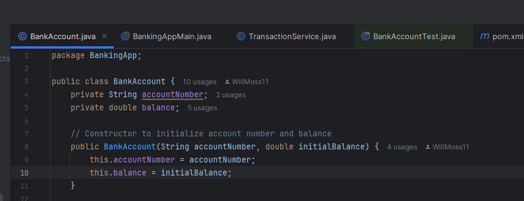
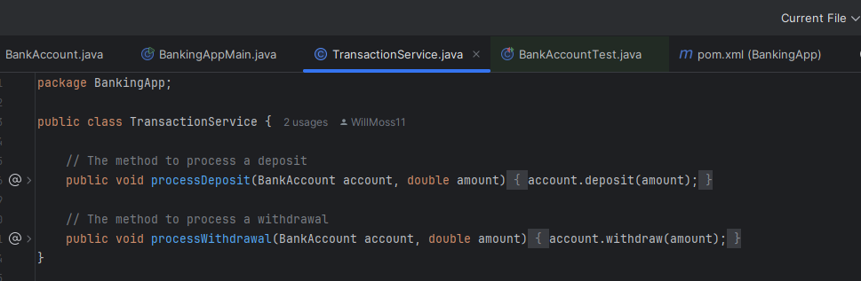
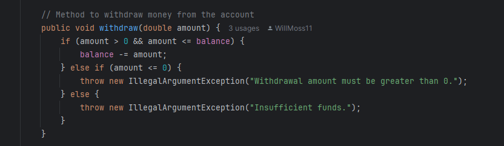

<h1 align="left">Documentation</h1>

###

<h4 align="left">1. Explain how your code meets clean code practices by using at least 3 examples of your own code. Screenshots should be used</h4>

###

###

Why it’s clean: The names accountNumber, balance, and initialBalance are descriptive and make it easy to understand the purpose of the variables and constructor.

###

~~~~~~~~~~~~~~~~~~~~~~~~~~~~~~~~~~~~~~~~~~~~~~~~~~~~~~~~~~~~~~~~~~~~~~~~~~~

###

###

Why it’s clean: The processDeposit and processWithdrawal methods are focused on one task, making the code easier to test and maintain.

###

~~~~~~~~~~~~~~~~~~~~~~~~~~~~~~~~~~~~~~~~~~~~~~~~~~~~~~~~~~~~~~~~~~~~~~~~~~~

###

###

Why it’s clean: The error handling is clear, and the error messages are descriptive. This makes it clear why an operation failed and is good at debugging.

###

~~~~~~~~~~~~~~~~~~~~~~~~~~~~~~~~~~~~~~~~~~~~~~~~~~~~~~~~~~~~~~~~~~~~~~~~~~~

###

<h4 align="left">2. Explain your project. What it does, how it works. Explain the test cases you used</h4>

###

<h4 align="left">What it does:</h4>

###

The Simple Banking Application is a CLI-based Java application that simulates basic banking operations like depositing and withdrawing funds from a bank account. The project aims to demonstrate clean coding practices, unit testing, and the use of Maven for dependency management.

###

<h4 align="left">How it works:</h4>

###

BankAccount class: Manages account details, balance, and provides methods for deposit and withdrawal. TransactionService class: Contains methods to handle the transactions (deposit and withdrawal) by calling the corresponding methods on BankAccount. BankingAppMain class: Serves as the entry point, where we create an account and perform transactions.

###

<h4 align="left">Test Cases</h4>

###

I wrote a few test cases to make sure of the functioning of my code:  testDeposit(): Verifies that depositing money increases the balance correctly. testWithdrawal(): Verifies that withdrawing money decreases the balance correctly. testInsufficientFunds(): Ensures that an exception is thrown when attempting to withdraw more than the available balance.

###

<h4 align="left">3. Outline the needed dependencies. Where did you get them from?</h4>

###

<h4 align="left">Dependencies</h4>

###

JUnit 5 for unit testing JUnit Jupiter API: Provides the statement needed for testing. JUnit Jupiter Engine: Runs the JUnit tests. JUnit Platform Launcher: Allows launching tests

###

<h4 align="left">Fetched from</h4>

###

Maven Central API: https://central.sonatype.com/artifact/org.junit.jupiter/junit-jupiter-api/5.10.0?smo=true Engine: https://central.sonatype.com/artifact/org.junit.jupiter/junit-jupiter-engine/5.10.0?smo=true Launcher: https://central.sonatype.com/artifact/org.junit.platform/junit-platform-launcher/1.10.0?smo=true

###

<h4 align="left">4. If you had any problems the QAP please explain what happened.</h4>

###

I did have a few problems I ran into. The first was the Test Failures, for some reason I could not get the JUnit imports to work on the Test file. Figured out it was the incorrect version....oops The second problem I ran into was the Actions setup on GitHub. I Had to manually pull it through IntelliJ with a new test file commit. Fortunately, I fixed it.

###
